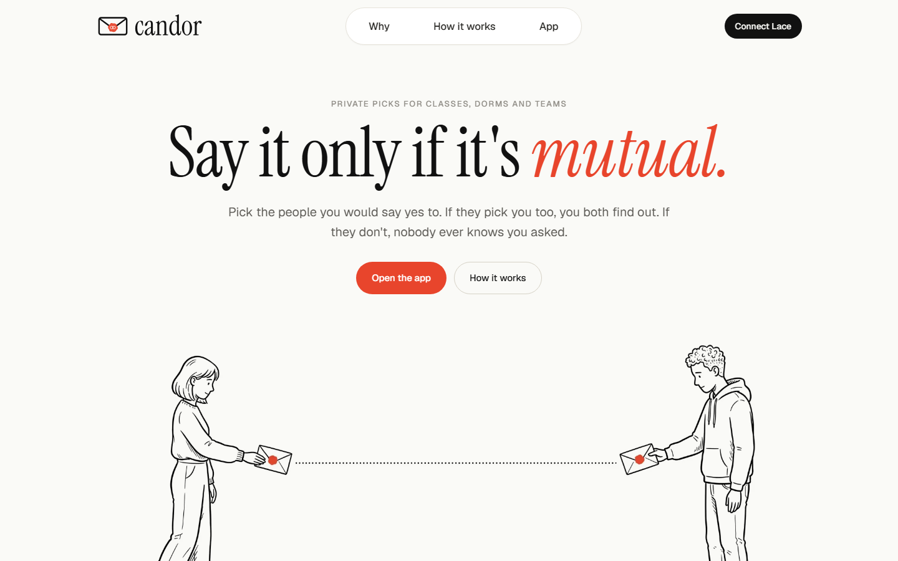
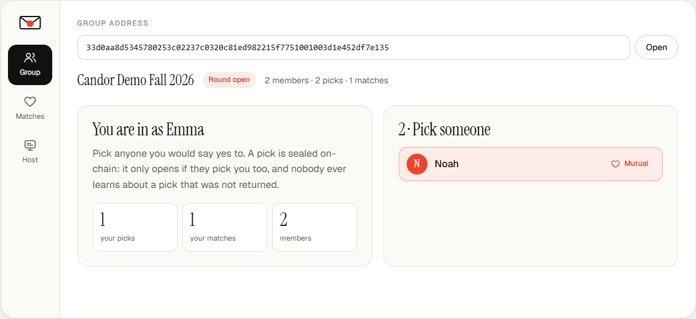
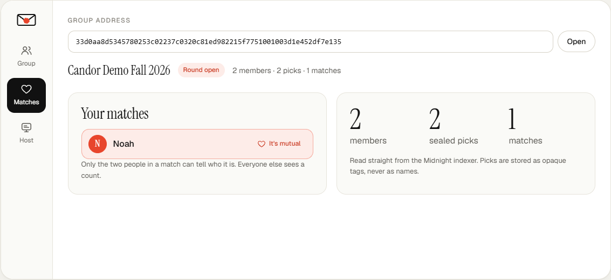
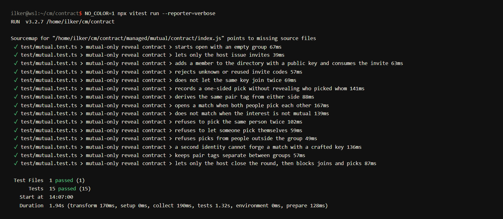
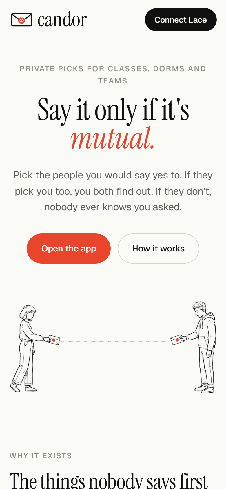

<p align="center">
  <picture>
    <source media="(prefers-color-scheme: dark)" srcset="ui/public/img/candor-logo-dark.svg">
    <source media="(prefers-color-scheme: light)" srcset="ui/public/img/candor-logo.svg">
    
  </picture>
</p>

<p align="center"><strong>Say it only if it's mutual.</strong><br>
Sealed picks inside verified groups, proven with zero-knowledge on Midnight.</p>

<p align="center">
  <a href="https://candor-mutual.vercel.app"></a>
  <a href="https://github.com/ilkerK01/candor-mutual/actions/workflows/ci.yml"></a>
  
  
  
  <a href="https://x.com/candormutual"></a>
</p>

<p align="center"></p>

Some things are only safe to say when the other person feels the same: *I'd like to work with you on the final project*, *I'd room with you next year*, *I'm sorry, can we fix this?* Saying it first is a risk, so most people never say it.

**The only cost is the first step. Candor makes it free.**

Inside a verified group (a class, a dorm, a team) each member can privately pick the people they would say yes to. If two people pick each other, both see the match. If a pick is not returned, it stays sealed forever: the person who was picked, the host and everyone reading the chain learn nothing.

> Go first without going first. No risk in asking, no trace if it's not.

Built for the Rise In × Midnight **New Moon to Full** program, Level 4. Track: *Consumer & Social*.

## Live Demo

**https://candor-mutual.vercel.app**

Demo group: https://candor-mutual.vercel.app/?group=33d0aa8d5345780253c02237c0320c81ed982215f7751001003d1e452df7e135#app

Reading a group needs nothing but a browser. Joining and picking need Lace on Midnight Preprod and a local proof server; see [docs/USAGE.md](docs/USAGE.md).

The demo group went through the full flow on Preprod on 26 September 2026: deployed, two invites issued, two members joined, each picked the other, and the match opened. The two members, *Emma* and *Noah*, are demo identities created by the author to show the flow. They are not users.

## Contract Address

| Network | Address |
| --- | --- |
| Preprod | `33d0aa8d5345780253c02237c0320c81ed982215f7751001003d1e452df7e135` |

Group `Candor Demo Fall 2026`. Every transaction below can be checked on the Preprod indexer.

| Step | Circuit | Transaction | Block | Time (UTC) |
| --- | --- | --- | --- | --- |
| Deploy | `constructor` | `aee53ce5de66ea28403e1cc4947f0a4303da64781940aba1ee3a48c27f42db10` | 2717055 | 2026-09-26 10:53:24 |
| Invite 1 | `invite` | `a7df3133cafb9f6de57d0bcb9ec2652e43aaaa2768eb04d1f129486cbc98b04a` | 2717086 | 2026-09-26 10:56:30 |
| Invite 2 | `invite` | `8162df69c155e11c734edb011ef0f1af87c7abdbc6a2851bca4efe75e5560723` | 2717092 | 2026-09-26 10:57:06 |
| Emma joins | `join` | `d7cf61de856e38b29d3846c310286ad5c2eecd636b9b0d0b1eaec992255f4634` | 2717118 | 2026-09-26 10:59:42 |
| Noah joins | `join` | `c381db59f56353efe9a35357769fb33b73762dec6f1c18457865c5a9f7e7d519` | 2717132 | 2026-09-26 11:01:06 |
| Noah picks Emma | `choose` | `59dfe4f9dd96221a598519a7384ffefb770867394b1dcb4979931d605c1200c1` | 2717144 | 2026-09-26 11:02:18 |
| Emma picks Noah, match opens | `choose` | `c6323706a94829ae17a62858771b5cdd03903e4bf49c56081f56e76074d6c197` | 2717172 | 2026-09-26 11:05:06 |

```bash
curl -s https://indexer.preprod.midnight.network/api/v4/graphql -H 'content-type: application/json' \
  -d '{"query":"{ contractAction(address: \"33d0aa8d5345780253c02237c0320c81ed982215f7751001003d1e452df7e135\") { __typename transaction { hash block { height } } } }"}'
```

The same record is kept in [`deployments/preprod.json`](deployments/preprod.json).

## Screenshots

| Emma's view after both picks | The match, visible only to the pair |
| --- | --- |
|  |  |

| 15 tests on the compiled circuits | Mobile |
| --- | --- |
|  |  |

## How It Works

1. **A host starts a group.** The host deploys a group contract from the browser. The host key is a hash of a secret that stays in that browser.
2. **Invites.** The host issues single-use invite codes. Only a hash of each code goes on-chain, so a code is useless to anyone who only reads the chain.
3. **Joining.** A member opens the invite link, picks a display name and joins. The browser generates the member's secret key; the contract stores the public key and adds the member to a Merkle tree.
4. **Picking.** A member picks someone. The circuit proves membership in the tree without revealing which member is proving, and computes a *pair tag* from a Diffie-Hellman secret that only these two people can derive. The tag goes on-chain. A *nullifier* stops the same person from picking the same target twice.
5. **The match.** When the second person of a pair picks the first, the circuit produces the same tag. The contract sees it already in the set of picks and records a match. Each member's browser checks the match set against the tags it can compute, so only the pair ever sees who matched.

## Privacy Model

- **PUBLIC:** group name, round state, host key hash, member display names and public keys, pair tags of sealed picks, nullifiers, match tags, and the counts of members, picks and matches.
- **PRIVATE:** every member's secret key and the host secret (browser storage, passed to circuits only as witnesses), the Merkle path used in each proof, and the link between a pair tag and the two people behind it.
- **PROVED without revealing:** that the picker is a member of the group, that they have not picked this person before, that they are not picking themselves, and that host actions come from the host.

| Data | Where it lives | Who can see it |
| --- | --- | --- |
| Group name, round state | Public ledger | Everyone |
| Member names and public keys | Public ledger | Everyone in the group, so they can pick each other |
| Invite codes | Only a hash on the ledger | The host and the person who received the link |
| Sealed picks | Pair tags on the ledger | Everyone sees that a pick happened, not who made it or for whom |
| Matches | Match tags on the ledger | Only the two people in the pair can tell who it is |
| Secret keys | Browser storage, witness only | Only the owner |

## Contract

`contract/mutual.compact`

| Circuit | Who | What it does |
| --- | --- | --- |
| `constructor(name)` | Host | Stores the group name and the host key hash, opens the round |
| `invite(codeHash)` | Host | Adds a single-use invite hash |
| `join(code, name)` | Invited person | Consumes the invite, stores name and public key, adds the member to the Merkle tree |
| `choose(target)` | Member | Proves membership, spends a nullifier, stores the pair tag or opens a match |
| `closeRound()` | Host | Stops joins and picks; matches stay |

Compiled output (circuits, prover and verifier keys, ZKIR, TypeScript bindings) is committed in `contract/managed/`, and CI checks that it matches the source.

## Tech Stack

- **Contract:** Compact (compiler 0.31.1), Jubjub keys with `ecMul` for the shared pair secret, `HistoricMerkleTree<10, Bytes<32>>` for membership, `Set<Bytes<32>>` for picks, nullifiers and matches
- **SDK:** Midnight.js 4.1.1, compact-js 2.5.1, compact-runtime 0.16.0, ledger v8
- **Wallet:** Lace (Midnight Preprod) through the DApp Connector API 4.x
- **Frontend:** React 19, Vite 7, TypeScript. Typefaces Instrument Serif and Geist, both under the SIL Open Font License, self-hosted in `ui/public/fonts`
- **Proving:** local proof server `midnightntwrk/proof-server:8.1.0`
- **Tests:** Vitest against the compiled contract
- **CI:** GitHub Actions
- **Hosting:** Vercel

## Prerequisites

- Node.js 22
- Docker
- Compact toolchain, `compact update 0.31.1`
- Lace wallet with Midnight set to **Preprod**, tNIGHT from the [faucet](https://faucet.preprod.midnight.network/) and tDUST generation turned on

On Windows, run everything inside WSL (Ubuntu).

## Setup & Run Locally

```bash
git clone https://github.com/ilkerK01/candor-mutual.git
cd candor-mutual

docker run -d --name midnight-proof -p 6300:6300 midnightntwrk/proof-server:8.1.0 midnight-proof-server -v

npm install
npm run compile
npm test

cd ui
npm run dev
```

Open the local URL Vite prints and connect Lace. In Lace, set **Settings → Midnight → Proof Server** to **Local (http://localhost:6300)**.

Proofs go to the proof server in `VITE_PROOF_SERVER_URL` (default `http://localhost:6300`). Midnight's hosted Preprod proof server rejects browser requests, so a local one is required. If the variable is empty, the app uses the wallet's own proving provider.

## Usage

Step-by-step guide for hosts and members, with troubleshooting: **[docs/USAGE.md](docs/USAGE.md)**.

## Run Tests

```bash
npm test
```

`contract/test/mutual.test.ts` runs the compiled circuits with the Compact runtime, no mocks. 15 tests cover:

- **invites and joining:** only the host issues invites, codes work once, unknown codes are rejected, the same key cannot join twice
- **picks:** a one-sided pick is stored without revealing who picked whom, both sides derive the same pair tag, a mutual pick opens a match, a one-sided one does not
- **abuse:** no double picks, no self picks, no picks from outside the group, a second identity cannot forge a match with a crafted key, tags from one group do not work in another
- **round control:** only the host closes the round, and a closed round blocks joins and picks

## CI/CD

`.github/workflows/ci.yml` runs on every push to `main` and every pull request:

1. installs Node 22 and the Compact toolchain pinned to 0.31.1
2. compiles the contract to ZK circuits
3. checks that the committed circuits match the source
4. installs dependencies with `npm ci`
5. runs the contract test suite
6. type-checks the API layer
7. builds the production web app

The web app is deployed to Vercel at https://candor-mutual.vercel.app.

## Project Layout

```
contract/     Compact contract, witnesses, compiled output (managed/), tests
api/          Deploy, join, pick and state helpers shared by the web app
ui/           React + Vite web app with Lace wallet integration
docs/         Usage guide and screenshots
deployments/  Preprod deployment record
```

## Roadmap

1. **Pilot groups on Preprod.** Real classes and dorms, feedback form linked from the app.
2. **Batch invites.** Many invite hashes per transaction for large groups.
3. **Hosted proving.** Wallet-side proving so members need nothing but Lace.
4. **Mainnet.**

## Notes for Reviewers

- **Reading needs nothing.** Open the demo group link; members and counts come from the public indexer.
- **Writing needs Lace and a local proof server.** See [docs/USAGE.md](docs/USAGE.md). The live site is served over HTTPS and calls `http://localhost:6300`, which Chrome allows because localhost is a secure context.
- **Pinned dependency versions** in the root `package.json` `overrides` are deliberate. `@midnight-ntwrk/ledger-v8` and `@midnight-ntwrk/onchain-runtime-v3` must resolve to a single copy each, otherwise two WASM instances end up in the bundle and transactions fail with `expected instance of _LedgerParameters`. `@swc/core` is pinned because newer builds break `vite-plugin-top-level-await`.

## Links

- Live app: https://candor-mutual.vercel.app
- X: https://x.com/candormutual
- Earlier levels (L1 to L3, anonymous course evaluation under the same Candor name): https://github.com/ilkerK01/anon-course-eval

## License

MIT, see [LICENSE](LICENSE).
